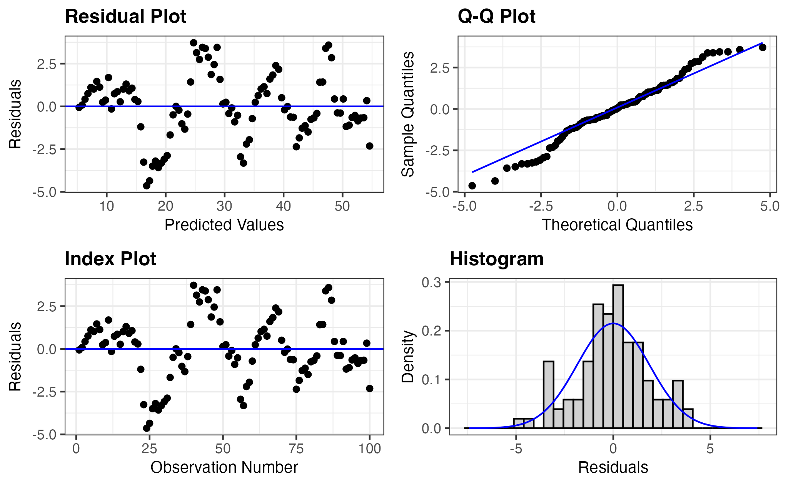
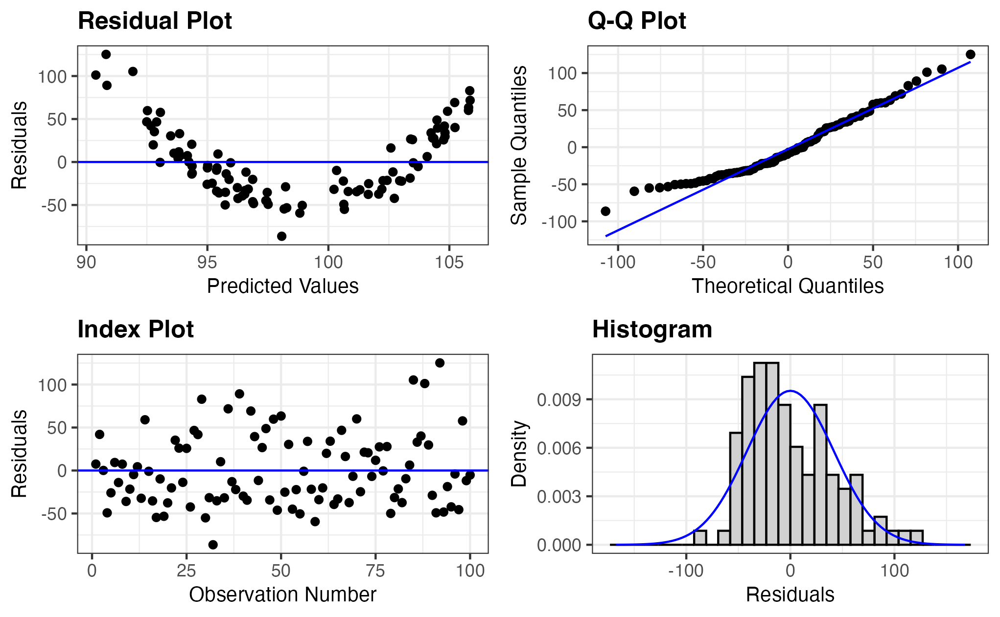
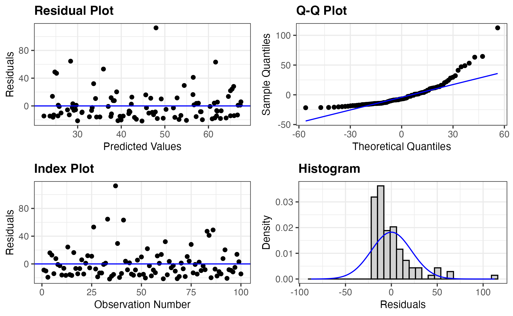
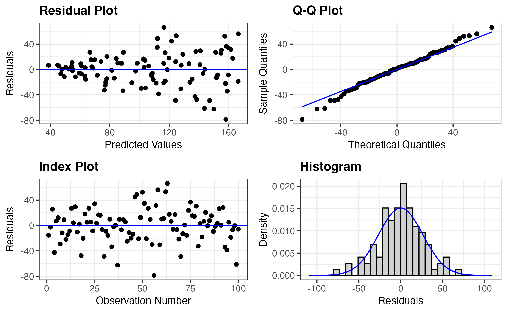

```{r}
#| echo: false
#| warning: false
#| message: false

library(ggplot2)
library(ggformula)
library(here)
library(broom)
```

Due: Friday of Week 2 at start of class

There is a [homework template](hw-template.qmd) available if you'd like to use that as a starter file, and copy and paste the code as needed. 

::: callout-important
## Important! 

I will add problems after each class day. Be sure to check back here after each class meeting for new problems.
:::


# Problem 1: Runoff (again)

```{r}
#| echo: false
#| fig-width: 4
#| fig-height: 3


runoff <- read.csv(here(here(), "data/runoff.csv"))

ggplot(runoff, aes(x = Precip, y = Runoff)) + 
  geom_point() + 
  theme_minimal() +
  labs(
    x = "Snowfall (inches)",
    y = "Runoff (acre-feet)"
  )
```

Below is the summary table produced when I fit the regression of the expected runoff given snowfall.

```{r}
#| include: false
lm(Runoff ~ Precip, data = runoff) |> summary()
```

```
Coefficients:
            Estimate Std. Error t value Pr(>|t|)    
(Intercept)  27014.6     ______   8.393 1.93e-10 ***
Precip        3752.5      215.7   _____  < 2e-16 ***
---
Signif. codes:  0 ‘***’ 0.001 ‘**’ 0.01 ‘*’ 0.05 ‘.’ 0.1 ‘ ’ 1

Residual standard error: 8922 on 41 degrees of freedom
Multiple R-squared:  0.8807,	Adjusted R-squared:  0.8778 
F-statistic: 302.6 on 1 and 41 DF,  p-value: < 2.2e-16
```

(a) Fill in the missing blanks (`______`) in the table

(b) Calculate a 80% confidence interval for the slope coefficient. Show your work.

(c) Interpret the confidence interval you calculated in part (b) in the context of the problem

(d) Based on your confidence interval in (b), is there convincing evidence of a relationship between snowfall and runoff? Explain. 

(e) The first data point in the dataset $(x_1, y_1)$ has `Precip = 6.47` and `Runoff = 54235`. Find $\hat{y}_1$ and $\epsilon_1$

# Problem 2: Hubble (again) 

The `ex0725` data points below are measured distances and recession velocities for 10 clusters of nebulae, much farther from earth than Hubble's data. 

```{r}
library(Sleuth3)
ex0725
```

(a) Fit a linear regression model to this data and report the fitted equation

(b) Perform a formal hypothesis test to assess whether the data is consistent with Hubble's theory (that the intercept is zero)


# Problem 3: Baby birth weights vs father's age

US Department of Health and Human Services, Centers for Disease Control and Prevention collect information on births recorded in the country. The data used here are a random sample of 1000 births from 2014. Here, we study the relationship between the father's age and the weight of the baby. 

```{r}
births14 <- openintro::births14
```

::: callout-tip
This code is shorthand for: look in the {openintro} R package for an object called `births14`
:::

(a) Make a scatterplot of birth weight (`weight`) as the response variable and father's age (`fage`) as the explanatory variable. Overlay a linear regression line and describe the relationship you see.

```{r}
# your code here
```

(b) Find and report the linear regression equation

```{r}
# your code here
```

(c) Do the data provide convincing evidence that there is a relationship between father's age and baby's birth weight? State the null and alternative hypotheses, report the p-value, and state your conclusion.

```{r}
# your code here
```

(d) Based on your conclusion, is father’s age a useful predictor of baby’s weight?


# Problem 4

For each of the following questions, explain whether a confidence interval for a mean response or a prediction interval for a new observation is appropriate. 

(a) What will be the humidity level in this greenhouse tomorrow when we set the temperature level at 31 degrees F?

(b) How much do families whose disposable income is $23,500 spend, on average, for meals away from home? 

(c) How much kilowatt-hours of electricity will be consumed next month by commerical and industrial users in the Twin Cities service area, given that the index of business activity for the area remains at its present level? 

# Problem 5: Runoff (again again)

::: callout-note
You do not need R for this problem! You should compute the intervals "by hand" using the R output here and from Q1
:::

In Problem 1d on this homework, you found the prediction and residual for the first data point in the `runoff` dataset $(x_1, y_1)$: has `Precip = 6.47` and `Runoff = 54235`. Below is selected output from running `predict()` on that data point with `se.fit = TRUE`. 

```{r}
#| echo: false 
res <- lm(Runoff ~ Precip, data = runoff) |> 
  predict(newdata = runoff[1,], se.fit = TRUE) 

res[-1]
```

(a) Using the output above, obtain a 95% interval for the average runoff for winters with 6.47 inches of snowfall. Provide a 1-2 sentence interpretation of your interval in context. 

(b) Suppose the projected snowfall total for Winter 2025/2026 is 6.47. Obtain a 95% interval for this year's runoff. Provide a 1-2 sentence interpretation of your interval in context. 

(c) If we instead considered a data point with `Precip = 12.5`, would you expect the two intervals to be wider or narrower? Explain using both the mathematical formula for creating the intervals and using the intuition given by what we've seen in class of the variability of the line. 

# Problem 6

The data set below was collected by Educational Testing Services (ETS) and consists of 1,000 randomly selected students at an unnamed college. We are interested in predicting first year GPA (`FYGPA`) from the sum of the verbal and math percentiles (`SATSum`). Load the data with the following code: 

```{r}
#| include: false

runoff <- read.csv(here(here(), "data/satGPA.csv"))
```

```{r}
#| eval: false
sat_gpa <- read.csv("http://aluby.github.io/stat230/data/satGPA.csv")
```

(a) Fit the simple linear regression model predicting first year GPA from the sum of the verbal and math SAT percentiles. Report the fitted regression equation. 

(b) Obtain a 95% interval for the average first year GPA for students whose SAT percentiles sum to 120. Interpret your interval. 

(c) Obtain a 95% interval for the first year GPA of Veronica Davis who who scored an SAT sum of 120. Interpret your interval.

(d) Make a plot that includes (1) the explanatory and response variables as a scatterplot, (2) the linear regression line, (3) the confidence interval for all points, and (4) the prediction interval for all points. 

# Problem 7: Reading residual plots

For each part of this question, use the provided residual plots to determine whether the conditions for inference appear to be valid. If you decide that a condition is violated, make sure to specify which one and how you can tell using the plots. Each model uses different data sets. 

(a) 



(b) 



(c) 



(d) 



(e) Using the residual plots, provide a sketch of what the original X-Y scatterplot looked like for each of (a)-(d)

# Problem 8: Animals metabolic rate

The following data comes from *Statistical Sleuth* Chapter 8. The data are the average mass, metabolic rate, and lifespan for 95 species of mammals. [Kleiber’s law](https://en.wikipedia.org/wiki/Kleiber%27s_law) states that the metabolic rate of an animal species, on average, is proportional to its mass raised to the power of 3/4.

```{r}
animals <- Sleuth3::ex0826
head(animals)
```

(a) Make a plot of average metabolic rate vs. mass for the 95 animals in this dataset. Make sure the axes are appropriately labeled. Comment on the relationship (shape, strength, direction of association).

(b) Fit the simple linear model of metabolic rate against mass and report the regression equation. 

(c)  Plot the residuals from the model in part (b) vs. the mass. To see what is going on more easily, also plot the residuals vs. the log(mass). Are the SLR conditions satisfied?

(d) Make a plot of the log(metablic rate) vs. the log(mass) with a regression line overlaid. Compare with the plot in (a). Do you think this scatterplot will be better or worse in terms of meeting the SLR conditions than the plot in (a)? (you do not need to fit this model)


