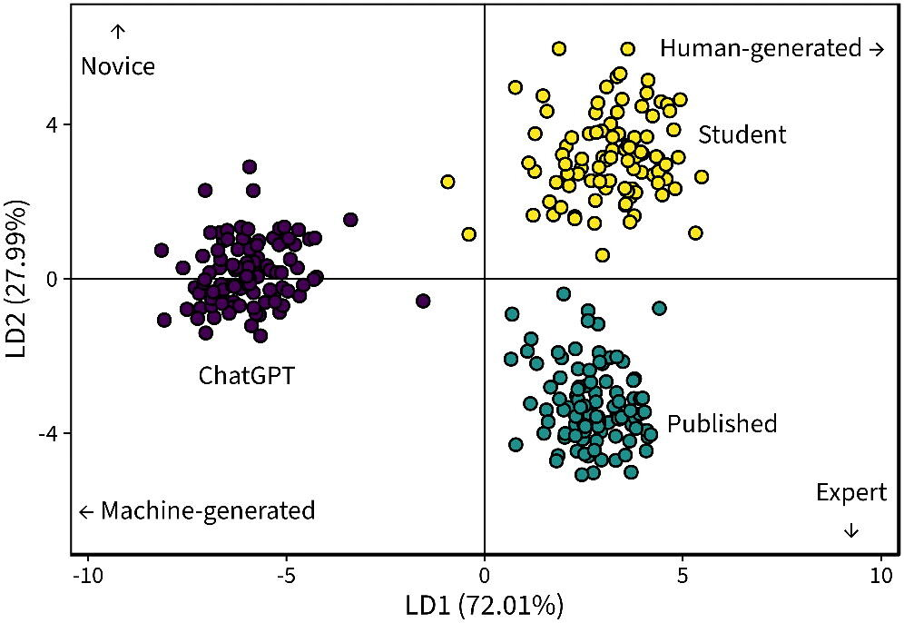

```{r}
#| echo: false
#| warning: false
#| message: false

library(gtrendsR)
library(countdown)
library(tidyverse)
library(lubridate)
```

# Intros

## 👋 I'm Amanda (she/her)

::::: columns
::: {.column width="50%"}
-   Second year at Carleton!
-   Taught at Swarthmore for 5 years before moving here
-   PhD in Statistics & Data Science from Carnegie Mellon University
-   Grew up in Minnesota, went to St Ben's as an undergrad
-   When I'm not writing R code, making graphs, or chasing after my toddler, I like to read and have been trying to do more fiber crafts
:::

::: {.column width="50%"}

:::
:::::

# 👋 I'm Noah

## Proud of/ Nervous about {.center}

## In groups of 2-3

::: {.task .nonincremental}
1.  Introduce yourselves: name, year, academic interest, personal interest
2.  Share a bit about why you're taking this class
:::

```{r}
#| echo: false

countdown::countdown(8)
```

## What is this class about?

- Second course in statistics
- Develop models to answer research questions about relationships

## Examples of research questions we'll be able to answer {.smaller}

```{r}
#| label: setup-plot-data
#| include: false
#| warning: false

library(tidyverse)
set.seed(032526) 

# 1. Simple Linear Regression Data
d1 <- tibble(calls = runif(50, 20, 80), temp = 30 + 0.5 * calls + rnorm(50, 0, 5))
p1 <- ggplot(d1, aes(x = calls, y = temp)) + 
  geom_point(color = "#003300", size = 3, alpha = 0.7) + 
  geom_smooth(method = "lm", color = "#40531b", se = FALSE) +
  labs(x = "Bird Calls per Hour", y = "Temperature") +
  theme_minimal(base_size = 14)

# 2. Multiple Linear Regression Data
d2 <- tibble(
  sqft = runif(100, 1000, 4000),
  pool = sample(c("Yes", "No"), 100, replace = TRUE),
  price = 50000 + 150 * sqft + ifelse(pool == "Yes", 40000, 0) + rnorm(100, 0, 100000)
)

p2 <- ggplot(d2, aes(x = sqft, y = price, color = pool)) +
  geom_point(size = 3, alpha = 0.7) +
  geom_smooth(method = "lm", se = FALSE) +
  scale_color_manual(values = c("Yes" = "#003300", "No" = "gray60")) +
  labs(x = "Square Footage", y = "Sale Price", color = "Pool?") +
  theme_minimal(base_size = 14)

# 3. Logistic Regression Data
d3 <- tibble(
  age = runif(100, 30, 80),
  prob = plogis(-8 + 0.15 * age), # plogis safely calculates the logistic curve
  disease = rbinom(100, 1, prob)
)

p3 <- ggplot(d3, aes(x = age, y = disease)) +
  geom_jitter(height = 0.05, alpha = 0.5, size = 3, color = "#003300") +
  geom_smooth(method = "glm", method.args = list(family = "binomial"), color = "#40531b", se = FALSE) +
  labs(x = "Patient Age", y = "Probability of Heart Disease") +
  theme_minimal(base_size = 14)

# 4. Poisson Regression Data
d4 <- tibble(
  defense = runif(50, 1, 10), 
  goals = rpois(50, exp(1 - 0.2 * defense))
)

p4 <- ggplot(d4, aes(x = defense, y = goals)) +
  geom_jitter(width = 0.2, height = 0.1, size = 3, alpha = 0.6, color = "#003300") +
  geom_smooth(method = "glm", method.args = list(family = "poisson"), color = "#40531b", se = FALSE) +
  labs(x = "Opponent Defense Strength", y = "Carleton Goals Scored") +
  theme_minimal(base_size = 14)
```

::::: columns
::: {.column width="50%"}
::: {.fragment fragment-index=1}

Does the number of bird calls heard in an hour accurately predict the outside temperature?
:::
::: {.fragment fragment-index=2}

How much does sale price of a house change based on whether it has a swimming pool, after controlling for square footage and age?
:::
::: {.fragment fragment-index=3}

Based on a patient's age, resting blood pressure, and cholesterol levels, what is the probability they will develop heart disease in the next decade?
:::
::: {.fragment fragment-index=4}

How many goals will the Carleton women's soccer team score depending on the strength of their opponent's defense?
:::
:::

::: {.column width="50%"}
::: {.r-stack}
::: {.fragment .fade-in-then-out fragment-index=1}

```{r}
#| echo: false
#| fig-width: 5
#| fig-height: 4.5
p1
```

:::

::: {.fragment .fade-in-then-out fragment-index=2}

```{r}
#| echo: false
#| fig-width: 5
#| fig-height: 4.5
p2
```

:::

::: {.fragment .fade-in-then-out fragment-index=3}

```{r}
#| echo: false
#| fig-width: 5
#| fig-height: 4.5
p3
```

:::

::: {.fragment .fade-in-then-out fragment-index=4}

```{r}
#| echo: false
#| fig-width: 5
#| fig-height: 4.5
p4
```

:::

:::

:::

:::::


## Intro Stat concepts

- Population vs sample
- Parameter vs statistic
- Observational study vs experiment
- Hypothesis test
- Confidence interval
- Sampling distribution
- Exploratory data analysis: scatterplots, bar plots, summary statistics, etc.

## In groups of 2-3

::: {.task .nonincremental}

- Work through the questions on the handout together
- Choose a person who will write assigned answer(s) on the board
- Make a note of any questions you're not sure about

:::

```{r}
#| echo: false

countdown::countdown(15)
```

# Syllabus highlights

Read the full syllabus by next class

## {.nonincremental}

### Moodle

-   access slides
-   see schedule

### Gradescope

-   submit assignments
-   access through moodle to automatically enroll

### Ed

-   contact Amanda
-   get homework help

## Office hours (*tentative*)

| Day       | Time                | Type    | Location |
|:----------|:--------------------|:--------|:---------|
| Monday    | 3-4pm               | Drop-in | CMC 307  |
| Tuesday   | 2-3pm               | Drop-in | CMC 307  |
| Wednesday | 9:30-10:30 (stat120)| Drop-in | CMC 307  |
| Friday    | 10-11  (stat230)    | Drop-in | CMC 223  |

## What will you do in this course?

::::: columns
::: {.column width="50%"}
**Graded work:**

-   Homework
-   Case Studies
-   Exams
-   Final Project
:::

::: {.column width="50%"}
**Ungraded work:**

-   Prepare for class
-   Read textbook
-   Practice problems
-   Attend and engage in class
:::
:::::

## What will a typical day/week look like?

:::::: columns
::: {.column width="30%"}
**Before class:**

-   Watch a video or read a chapter
-   Be prepared to try what was covered
:::

::: {.column width="30%"}
**In class:**

-   Mini lecture
    -   Sometimes review
    -   Sometimes new
-   Hands-on coding in R
-   Group work
:::

::: {.column width="30%"}
**After class:**

-   Finish in-class exercises
-   Work on homework and case studies
:::
::::::

## Grading

- 15% Homework
- 30% Exams (10% each)
- 25% Final Project
- 25% Case Studies (8.33% each)
- 5% Attendance and participation in group work
    - 5+ absences &rarr; 0%
-   Letter grades will be assigned based on the usual grading scale (A = 93%+, A- = 90-92.9%, B+ = 88-89.9%, B = 83-87.9, etc.)

## Tokens

You have 4 tokens that you can use throughout the term. Tokens can be redeemed for: 

- 48 hour extension on a homework assignment or case study due date
- Submit revisions to a quiz (earn up to 33% of points back)
- Revise a case study

I may also ask you to use a token for other as-needed arrangements throughout the term. Some examples: 

- extended absences
- last minute makeups for quizzes

I will track balances in the moodle gradebook (updated weekly, typically Fridays)

## Academic Integrity

> You are expected to follow Carleton’s [policies regarding academic integrity](https://www.carleton.edu/handbook/academics/?policy=329). I encourage you to discuss the homework problems with other humans and do background reading as needed. You should code and write up your solutions on your own. Exams must be done by yourself without communicating with others; all work must be your own. You should collaborate with your teammates on projects, and should use external resources for background research and debugging, but all work should be original and all sources should be properly cited. The use of textbook solution manuals (physical or online), course materials from other students, or materials from previous versions of this course are not allowed.

## AI policy {.smaller}

> Large-language models (e.g. ChatGPT, Gemini, etc.) should only be used for coding or debugging help after you’ve attempted to solve the problem on your own, and you should never type homework problems directly into a prompt. Copying, paraphrasing, summarizing, or submitting work generated by anyone but yourself without proper attribution is considered academic dishonesty (this includes output from LLMs).

> I also have a few rules in place to protect my intellectual property. You may not record my lectures using tools such as Otter.ai or upload any video or audio recordings to generate transcripts or study notes. You may not upload my course materials (slides, assignment prompts, note sets, etc.) into AI tools or homework help sites.

> “AI” tools are new for all of us and it’s OK to have questions about what is and isn’t appropriate. Please ask if you are unsure of whether or not your actions are complying with the assignment/quiz/project instructions. Always default to acknowledging any help received. Cases of suspected academic dishonesty are handled by the Provost’s Office and I am obligated to report any suspected violations of this policy.

## Specific guidelines {.smaller}

::: {.incremental}

-   **❌ AI tools for writing code:** You may not use generative AI to take a "first pass" at a coding task. Do not type coursework prompts directly into AI tools.

-   **✅ AI tools for debugging code:** You may make use of the technology to get help with error messages or trying to fix issues. Rule of thumb: never type code into or out of an AI interface

-   **❌ AI tools for narrative:** Unless instructed otherwise, you may not use generative AI to write narrative on assignments. 

-   **❌ AI tools for brainstorming:** Your brain is infinitely more capable than ChatGPT and your ideas are more interesting. 

-   **❌ AI tools for editing:** AI has a distinct writing style that I do not care for, especially when it comes to statistical writing. If your reports have an AI-generated flavor, you will not earn a good grade, even if you wrote it yourself

-   **✅ AI tools for background reading:** AI companies have stolen teaching material from some of the best educators in the world! If you don't understand something from class and the homework, first try reading the textbook. If you still don't understand, you can ask AI to explain *the concept* (not a specific problem) in more detail. It won't always be right; always default to the textbook or course material if you encounter conflicting explanations. 

:::

## AI vs learners vs experts


{.r-stretch}

::: aside
Source: DeLuca, L. S. et al (2025). [Developing Students’ Statistical Expertise Through Writing in the Age of AI](https://doi.org/10.1080/26939169.2025.2497547). *Journal of Statistics and Data Science Education*, 33(3), 266–278.
:::

## Before next class: 

::: {.task .nonincremental}
1. Review solutions to activity on Moodle
2. **Sign up** for our Ed discussion board: <https://edstem.org/us/join/9uGcQg>
3. Complete the **welcome survey**
4. Review the [**full syllabus**](/syllabus.html)
5. Make sure you can **access** <https://maize.mathcs.carleton.edu> with your Carleton credentials
6. Skim textbook chapters and come prepared for some simple linear regression next time!
:::
