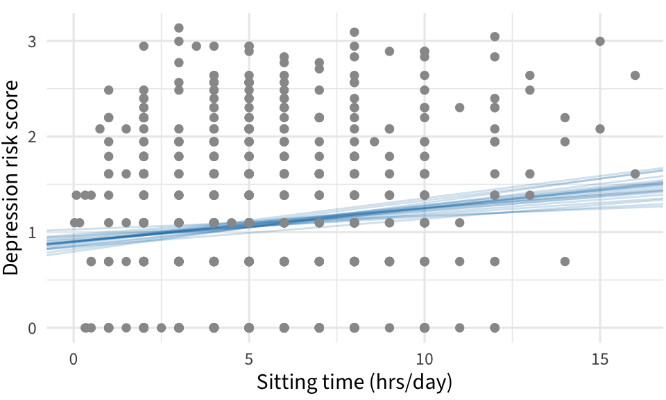
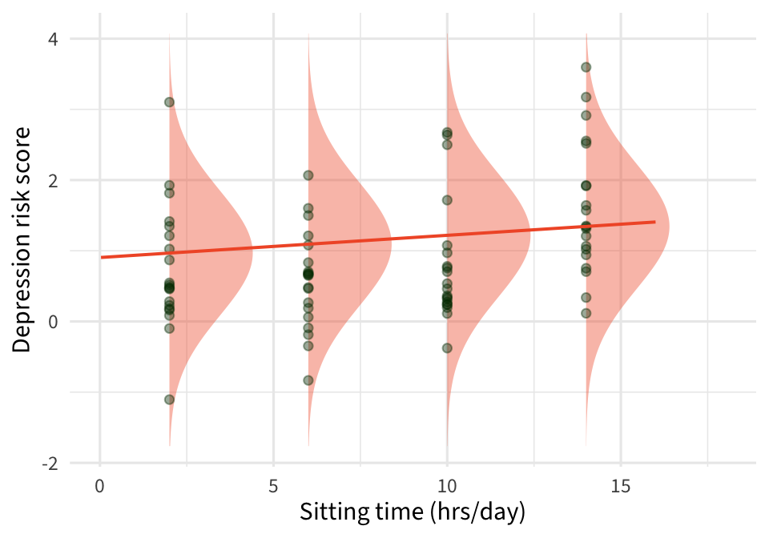

```{r}
#| echo: false
#| warning: false
#| message: false

library(countdown)
library(tidyverse)
library(bayesrules)
library(ggformula)
library(rsample)
library(broom)
library(gganimate)
library(patchwork)
library(fontawesome)
notes_theme = theme_minimal(base_size = 12, base_family = "Source Sans 3")
theme_set(notes_theme)
```


## Last Time

1. Sampling distribution for $\beta_i$'s

2. Confidence intervals for $\beta_i$'s

3. HTs for $\beta_i$'s

4. By hand and by R

. . . 

### Today: inference for *predictions*

## Groups

Find your groups 

::: task

1. Introductions: name, year, intended major

2. Temperature check: how are you feeling about SLR so far? How about R?

3. Set group expectations for next two weeks

:::

```{r}
countdown::countdown(6)
```

## Warm up activity

::: task

Work through the questions on the worksheet about the relationship between income and education level for a sample of **riverview** city employees

:::

```{r}
countdown::countdown(10)
```

## Prediction

There are two types of predictions in regression

. . .

1.  Predicting the **mean response** at a specific value of $x$

    e.g., the average number of riders on a 62 degree day

<br>

. . .

2.  Predicting the response for a **specific future observation**

    e.g., predicting the number of riders **tomorrow** (forecast to be 62 degrees)

. . .

<br>

`r fa("comments")` Think of two additional examples of each type of prediction.

## Inference for prediction

Best estimate $\widehat{y}_i = \widehat{\beta}_0 + \widehat{\beta}_1 x_0$

<br>

. . .

Interval formula: $\text{estimate} \pm t^* \times \text{SE}$

-   $\widehat{y}$ is our estimate
-   Use a $t$-distribution with $df=n-2$ to find $t^*$

<br>

. . .

We'll need different SEs depending on if we are building a

-   confidence interval for $\widehat{\mu}(Y|X_0)$

-   prediction interval for $\widehat{y}$ or $\text{Pred}(Y|X_0)$

## Standard errors

$\text{SE}(\widehat{\mu}(Y|X)) = \widehat{\sigma} \sqrt{\dfrac{1}{n} + \dfrac{(x_0-\overline{x})^2}{\sum_{i=1}^n (x_i - \overline{x})^2}}$

. . .

$\text{SE}(\widehat{y})= \widehat{\sigma} \sqrt{1+\dfrac{1}{n} + \dfrac{(x_0-\overline{x})^2}{\sum_{i=1}^n (x_i - \overline{x})^2}}$

::: {.fragment .fade-in-then-out}
`r fa("comments")` Looking at the standard errors for the two intervals, which interval will be wider? Why does this make sense?
:::

::: {.fragment .fade-in}
`r fa("comments")` As $x_0$ gets farther from $\overline{x}$ what happens to the standard errors?
:::

## Idea

::: small

$\text{SE}(\widehat{y})= \widehat{\sigma} \sqrt{1+\dfrac{1}{n} + \dfrac{(x_0-\overline{x})^2}{\sum_{i=1}^n (x_i - \overline{x})^2}} =  \sqrt{\bbox[#f15a31]{\widehat{\sigma}^2} + \bbox[lightblue]{\dfrac{\widehat{\sigma}^2}{n} + \dfrac{\widehat{\sigma}^2(x_0-\overline{x})^2}{\sum_{i=1}^n (x_i - \overline{x})^2}}}$

:::

::::{.columns}
::: {.column .fragment width="50%"}
<br> 

Captures variability in $\hat{\beta}_i$'s


:::
::: {.column .fragment width="50%"}
<br>

Captures variability in $\epsilon_i$'s


:::
::::

## R: Point estimate

We'll let R do the computational work

```{r}
#| include: false
bikes_lm <- lm(rides ~ temp_actual, data = bikes)
```

`predict` allows you to quickly calculate the value of $\widehat{y}$ for a given $x$ (or vector of $x$s)

```{r}
#| echo: true
predict(bikes_lm, newdata = data.frame(temp_actual = 52))
```

```{r}
#| echo: true
predict(bikes_lm, newdata = data.frame(temp_actual = c(52, 62, 72, 82)))
```

## R: Intervals

The `interval` argument allows you to specify the type of interval you want

```{r}
#| echo: true
#| code-line-numbers: "2"
predict(bikes_lm, newdata = data.frame(temp_actual = 52), 
        interval = "confidence")
```

<br>

```{r}
#| echo: true
#| code-line-numbers: "2"
predict(bikes_lm, newdata = data.frame(temp_actual = 52), 
        interval = "prediction")
```

## R: Intervals

The `level` argument allows you to specify the confidence level (0.95 is the default)

```{r}
#| echo: true
#| code-line-numbers: "3"

predict(bikes_lm, newdata = data.frame(temp_actual = 52), 
        interval = "confidence", 
        level = .95)
```

<br>

```{r}
#| echo: true
#| code-line-numbers: "3"

predict(bikes_lm, newdata = data.frame(temp_actual = 52), 
        interval = "prediction", 
        level = .99)
```

## R: SEs

Adding `se.fit = TRUE` returns the necessary standard errors for "by hand" calculations

```{r}
#| echo: true 
#| code-line-numbers: "2"

predict(bikes_lm, newdata = data.frame(temp_actual = 52), 
        se.fit = TRUE)
```


## Activity

::: task

-   Work with your group

-   Work through the Prediction and Confidence example on the worksheet

-   You can choose to work in Quarto/Rstudio or an R Tutorial (linked on moodle)

:::

