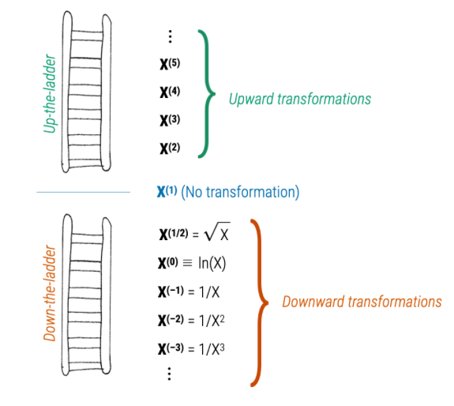
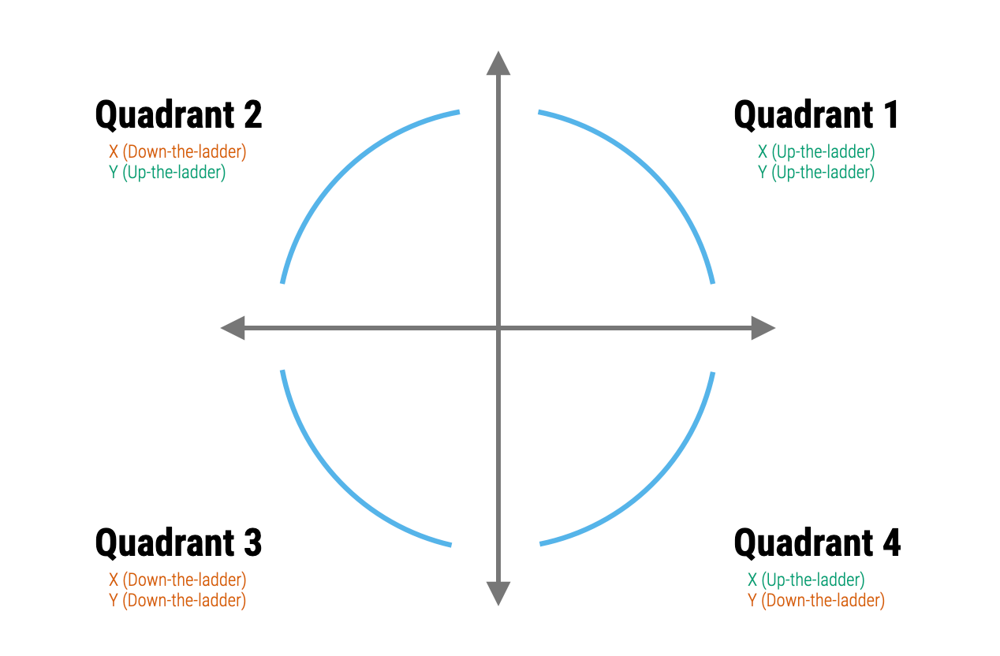
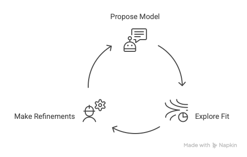

```{r}
#| echo: false
#| warning: false
#| message: false

library(countdown)
library(tidyverse)
library(bayesrules)
library(ggformula)
library(rsample)
library(broom)
library(gganimate)
library(patchwork)
library(fontawesome)
notes_theme = theme_minimal(base_size = 12, base_family = "Source Sans 3")
theme_set(notes_theme)

salarygov <- read.csv("https://github.com/math430-lu/data/raw/master/salarygov_inflated.csv")
redcedar <- read.csv("https://github.com/math430-lu/data/raw/master/ufcwc.csv")

```

## Last Time

<br>

How good is our model? 

  - Are any conditions for SLR *violated*?
  - Is there a strong predictive relationship between X and Y?
    
<br>

<br>

### Today: how can we fix the worst violation?

## Linearity

If the linearity condition is not met, 

  - We will have systematically biased predictions
  - Might draw false conclusions about existence or strength of a relationship
  - All inference about $\beta_0, \beta_1, \widehat\mu(Y|X), \text{Pred}(Y|X)$ is meaningless
  
## Easing skew

::: medium

If a set of data values is skewed to the right, taking the (natural) log of each data value *can* result in a data set that is roughly symmetric and often roughly normal.

:::

```{r}
#| echo: false
#| fig-align: 'center'


set.seed(1234)
data("case0802", package = "Sleuth3")

h1 <- gf_histogram(~Time, data = case0802, fill = "#003300", col = "white")
qq1 <- gf_qq(~Time, data = case0802, color = "#003300") %>% gf_qqline()

h2 <- gf_histogram(~log(Time), data = case0802, fill = "#003300", col = "white")
qq2 <- gf_qq(~log(Time), data = case0802, color = "#003300") %>% gf_qqline()


(h1 + h2)/(qq1 + qq2)
```

## 

How are tree height and tree diameter related for the western red cedar?

```{r}
#| echo: false
#| fig-asp: 0.6
#| fig-width: 4
gf_point(Height ~ Dbh, data = redcedar, alpha = 0.6, color = "#003300") %>%
  gf_labs(x = "Diameter at 137 cm above ground (in mm)", 
          y = "Height (in dm)")
```

## Are the conditions violated?

```{r}
#| echo: false
#| fig-asp: 0.6
#| fig-width: 2.75
#| out-width: 100%
#| layout-ncol: 3
redcedar_mod <- lm(Height ~ Dbh, data = redcedar)
aug_cedar <- augment(redcedar_mod)

gf_point(Height ~ Dbh, data = redcedar, alpha = 0.5, color = "#003300") %>%
  gf_lm(color = "#f15a31") %>%
  gf_labs(x = "Diameter (in mm)", y = "Height (in dm)")

gf_point(.resid ~ Dbh, data = aug_cedar, alpha = 0.5,color = "#003300") %>%
  gf_hline(yintercept = 0, col = "darkgreen", lty = 2) %>%
  gf_labs(x = "Diameter", y = "Residuals")

gf_qq(~ .resid, data = aug_cedar,color = "#003300") %>%
  gf_qqline() %>%
  gf_labs(x = "N(0, 1) quantiles", y = "Residuals")
```

::::: columns
::: {.column width="50%"}
(a) linearity

(b) independent errors

(c) normal errors
:::

::: {.column width="50%"}
(d) equal variance

(e) outliers

(f) none
:::
:::::

## Adding a smooth trendline

Adding `gf_smooth()` to the pipeline of code can help reveal curves. But trust your eyes first!

```{r}
#| echo: false
#| fig-asp: 0.6
#| fig-width: 2.75
#| out-width: 100%
#| layout-ncol: 2

gf_point(.resid ~ Dbh, data = aug_cedar, alpha = 0.5,color = "#003300") %>%
  gf_hline(yintercept = 0, col = "darkgreen", lty = 2) %>%
  gf_labs(x = "Diameter", y = "Residuals")

gf_point(.resid ~ Dbh, data = aug_cedar, alpha = 0.5,color = "#003300") %>%
  gf_hline(yintercept = 0, col = "darkgreen", lty = 2) %>%
  gf_smooth(col = "darkred") %>%
  gf_labs(x = "Diameter", y = "Residuals")

```

## Does transforming X help?

```{r}
#| echo: false
#| fig-asp: 0.6
#| fig-width: 2.75
#| out-width: 100%
#| layout-ncol: 3
logx_mod <- lm(Height ~ log(Dbh), data = redcedar)
aug <- augment(logx_mod)
xlab <- "Diameter (in mm) (log scale)"
ylab <- "Height (in dm)"
  
gf_point(Height ~ log(Dbh), data = redcedar, alpha = 0.5, color = "#003300") %>%
  gf_lm(color = "#f15a31") %>%
  gf_labs(x = xlab, y = ylab)

gf_point(.std.resid ~ .fitted, data = aug, alpha = 0.5, color = "#003300") %>%
  gf_hline(yintercept = 0, col = "darkgreen", lty = 2) %>%
  gf_labs(x = "Fitted values", y = "Std. residuals")

gf_qq(~ .std.resid, data = aug, color = "#003300") %>%
  gf_qqline() %>%
  gf_labs(x = "N(0, 1) quantiles", y = "Std. residuals")
```

## Does transforming Y help?

```{r}
#| echo: false
#| fig-asp: 0.6
#| fig-width: 2.75
#| out-width: 100%
#| layout-ncol: 3
logy_mod <- lm(log(Height) ~ Dbh, data = redcedar)
aug <- augment(logy_mod)
xlab <- "Diameter (in mm)"
ylab <- "Height (log scale)"
  
gf_point(log(Height) ~ Dbh, data = redcedar, alpha = 0.5, color = "#003300") %>%
  gf_lm(color = "#f15a31") %>%
  gf_labs(x = xlab, y = ylab)

gf_point(.std.resid ~ .fitted, data = aug, alpha = 0.5, color = "#003300") %>%
  gf_hline(yintercept = 0, col = "darkgreen", lty = 2) %>%
  gf_labs(x = "Fitted values", y = "Std. residuals")

gf_qq(~ .std.resid, data = aug, color = "#003300") %>%
  gf_qqline() %>%
  gf_labs(x = "N(0, 1) quantiles", y = "Std. residuals")
```

## Transforming both X and Y?

```{r}
#| echo: false
#| fig-asp: 0.6
#| fig-width: 2.75
#| out-width: 100%
#| layout-ncol: 3
logxy_mod <- lm(log(Height) ~ log(Dbh), data = redcedar)
aug <- augment(logxy_mod)
xlab <- "Diameter (log scale)"
ylab <- "Height (log scale)"
  
gf_point(log(Height) ~ log(Dbh), data = redcedar, alpha = 0.5, color = "#003300") %>%
  gf_lm(color = "#f15a31") %>%
  gf_labs(x = xlab, y = ylab)

gf_point(.std.resid ~ .fitted, data = aug, alpha = 0.5, color = "#003300") %>%
  gf_hline(yintercept = 0, col = "darkgreen", lty = 2) %>%
  gf_labs(x = "Fitted values", y = "Std. residuals")

gf_qq(~ .std.resid, data = aug, color = "#003300") %>%
  gf_qqline() %>%
  gf_labs(x = "N(0, 1) quantiles", y = "Std. residuals")

```

# Your turn

::: {.task}

-   Work through the first example on the handout in your groups

-   Online version with R chunks on moodle
::: 


# Back-Transforming

Converting a transformed variable back to its original scale

## {.smaller}

::::: columns
::: {.column width="50%"}
Log scale

```{r}
#| echo: false
#| fig-width: 4
#| fig-height: 2

gf_histogram(~log(Time), data = case0802, fill = "#003300", col = "white")
knitr::kable(mosaic::favstats(~log(Time), data = case0802)[c("mean")], format = "html", digits = 3, row.names = FALSE)

```
:::

::: {.column width="50%"}
Original scale

```{r}
#| echo: false
#| fig-width: 4
#| fig-height: 2


gf_histogram(~Time, data = case0802, fill = "#003300", col = "white")
knitr::kable(mosaic::favstats(~Time, data = case0802)[c("mean")], format = "html", digits = 3, row.names = FALSE)

```
:::
:::::

<br>

-   Back-transformed mean: $e^{2.146} \approx 8.55$

. . .

::: callout-note
## R Note

-   `log` is the natural log
-   `exp(x)` calculated $e^x$
:::

## Displaying a transformed model

::: medium

`gf_lm(formula = log(y) ~ log(x), backtrans = exp, interval = "confidence")`

:::

```{r }
#| echo: false
#| fig-asp: 0.7
#| fig-width: 4
#| out-width: 100%
#| layout-ncol: 2
left <- gf_point(log(Height) ~ log(Dbh), data = redcedar, alpha = 0.5, color = "#003300") %>%
  gf_lm(interval = "confidence", color = "#f15a31") %>%
  gf_labs(x = "Diameter (in mm)  (log scale)", y = "Height (in dm) (log scale)", title = "Transformed scale")

right <- gf_point(Height ~ Dbh, data = redcedar, alpha = 0.5, color = "#003300") %>%
  gf_lm(formula = log(y) ~ log(x), backtrans = exp, interval = "confidence", color = "#f15a31") %>%
  gf_labs(x = "Diameter (in mm)", y = "Height (in dm)", title = "Original scale")

left
right
```

::: footer
95% confidence intervals for the mean response are displayed
:::

## Rules of thumb 

::: medium

-   **transform x**: if mean function is nonlinear, but is monotonic and the residual variance is constant

-   **transform y**: if mean function is nonlinear and the residual variance increases as the mean increases (log, reciprocal, or square root often work)

-   **log rule**: if values range over more than 1 order of magnitude and are strictly positive, then the natural log is likely helpful

-   **range rule**: if the range is considerably less than 1 order of magnitude, then transformations are unlikely to help

-   **square roots** are useful for count data
:::

## Ladder of transformations



::: footer
Image credit: Andrew Zieffler
:::

## Rule of the Bulge {.smaller}

Introduced by John Tukey and Frederick Mosteller for “straightening” data to better meet the assumption of linearity



::: footer
Image credit: Andrew Zieffler
:::
  
## Modeling is an iterative process



## Issues with transformations

-   You're often guessing — Statistics is an art AND a science! <br>

-   Changes the interpretation of the parameters — need to back-transform to provide interpretable results <br>

-   Changes SEs of the parameters <br>

-   Not always easy to keep track of all your assumptions
