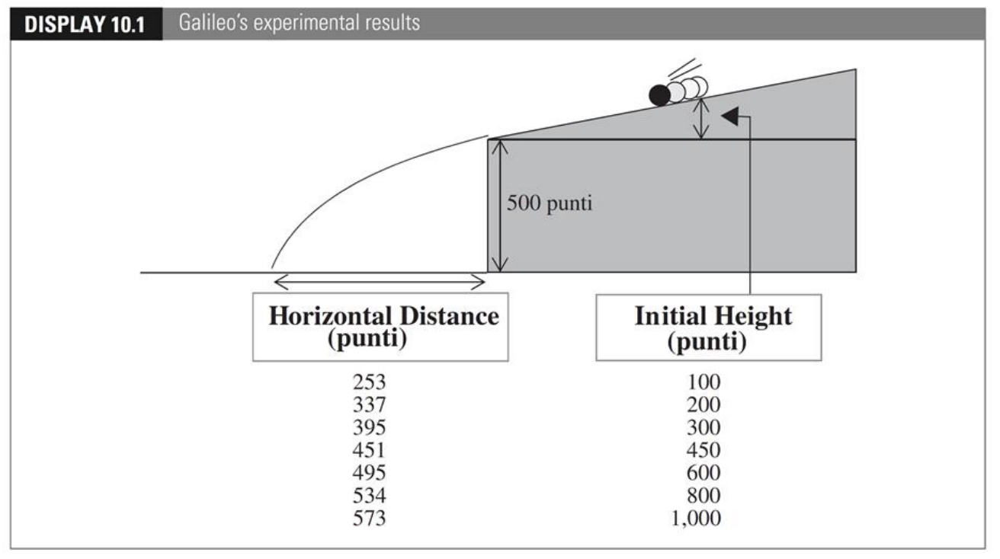

```{r}
#| echo: false
#| warning: false
#| message: false

library(countdown)
library(tidyverse)
library(bayesrules)
library(ggformula)
library(rsample)
library(broom)
library(gganimate)
library(patchwork)
library(fontawesome)
library(here)
library(gt)
library(gtsummary)
library(carData)

notes_theme = theme_minimal(base_size = 12, base_family = "Source Sans 3")
theme_set(notes_theme)

regression_panel <- function(formula, scat.formula = NULL, data, xlab, ylab) {
  mod <- lm(formula, data = data)
  
  aug <- augment(mod)
  
  plot_fit <- makeFun(mod)
  
  if(is.null(scat.formula)) {
    orig_data <- gf_point(formula, data = data, xlab = xlab, ylab = ylab, color = "#003300")
  } else {
    orig_data <- gf_point(scat.formula, data = data, xlab = xlab, ylab = ylab, color = "#003300") 
  }
  
  orig_data <- orig_data %>% gf_fun(plot_fit(x) ~ x, color = "#f15a31")
  
  resid_plot <- gf_point(.std.resid ~ .fitted, data = aug, xlab = "Fitted values", ylab = "Standardized residuals") %>%
    gf_hline(yintercept = 0, linetype = 2, color = "#f15a31")
  
  qq_plot <- gf_qq(~.std.resid, data = aug, xlab = "N(0,1) quantiles", ylab = "Standardized residuals", color = "#003300") %>%
    gf_qqline(color = "#f15a31")
  
  (orig_data | resid_plot | qq_plot)
}

UBSprices <- read.csv("http://aloy.rbind.io/data/UBSprices.csv")
bigmac.lm <- lm(bigmac2009 ~ bigmac2003, data = UBSprices)
florida <- read.csv("https://aluby.github.io/stat230/data/florida_2000.csv") 
florida_lm <- lm(BUCHANAN ~ BUSH, data = florida)
bikes_mlr <- lm(rides ~ temp_actual*weekend, data = bikes)

ex1 <- read.table("http://www.cnachtsheim-text.csom.umn.edu/Kutner/Chapter%20%207%20Data%20Sets/CH07TA06.txt")
colnames(ex1) <- c("x1", "x2", "y")

ex2 <- read.table("http://www.cnachtsheim-text.csom.umn.edu/Kutner/Chapter%20%207%20Data%20Sets/CH07TA08.txt")
colnames(ex2) <- c("x1", "x2", "y")

bodyfat <- read.table("http://www.cnachtsheim-text.csom.umn.edu/Kutner/Chapter%20%207%20Data%20Sets/CH07TA01.txt")
colnames(bodyfat) <- c("triceps_skinfold", "thigh_circumference", "midarm_circumference", "body_fat")
```

# Multicollinearity

Situation where 2+ predictors are "nearly" perfectly correlated


## Think about it

::: task
- Work through Examples 1-3 on worksheet

- Work with your group to complete the tasks

- Let me know when finish Task 6

- Be prepared to share thoughts with the class
:::

```{r}
countdown::countdown(30)
```

## Diagnosing multicollinearity 

:::{.incremental}
- Examine scatterplot matrix

- Examine pairwise correlations between predictors

- Look for $\widehat{\beta}_i$s with unusual signs

- Notice sensitivity to changes in the model/order of predictors

- Calculate the **Variance Inflation Factor (VIF)**
:::


## Variance Inflation Factor (VIF)


${\rm VIF} = \dfrac{1}{1 - R^2_i}$

$R^2_i=R^2$ from model predicting $x_i$ using all other predictor variables

. . .

Guidelines:

- $\text{VIF}_i > 5$ suspicions begin; $R^2_i > .8$
- $\text{VIF}_i > 10$ indicates a problem; $R^2_i > .9$
- $\text{VIF}_i > 100$ indicates a big problem; $R^2_i > .99$


## VIFs for Example 1

```{r}
#| eval: false
#| echo: true
ex1_mod <- lm(y ~ x1 + x2, data = ex1)
car::vif(ex1_mod)
```

<br>

```{r}
#| echo: false
#| eval: true
ex1_mod <- lm(y ~ x1 + x2, data = ex1)
car::vif(ex1_mod) |>
  as.data.frame() %>%
  mutate(Variable = rownames(.)) %>%
  rename(VIF = `car::vif(ex1_mod)`) |>
  relocate(Variable) |>
  gt() |>
  tab_options(
    table.font.size = px(28),
    table.font.color = "#003069"
  )
```


:::{.footer}
The `vif()` command is in the `car` R package
:::


## VIFs for Example 2

```{r}
#| error: true
#| echo: true
ex2_mod <- lm(y ~ x1 + x2, data = ex2)
car::vif(ex2_mod)
```

`car::vif()` throws an error! Why?

. . .

$\text{VIF} = \dfrac{1}{1 - R^2_i}$

:::{.incremental}
- Since $x_1$ and $x_2$ are perfectly correlated, $R^2_i = 1$

- This makes the denominator $1 - R^2_i = 0$

- So, $\text{VIF} = \dfrac{1}{0}$ is undefined
:::

## VIFs for Example 3

```{r}
#| eval: false
#| echo: true
bodyfat_mod <- lm(body_fat ~ ., data = bodyfat)
car::vif(bodyfat_mod)
```

<br>


```{r}
#| echo: false
#| eval: true
bodyfat_mod <- lm(body_fat ~ ., data = bodyfat)
car::vif(bodyfat_mod) |>
  as.data.frame() %>%
  mutate(Variable = rownames(.)) %>%
  rename(VIF = `car::vif(bodyfat_mod)`) |>
  relocate(Variable) |>
  gt() |>
    tab_options(
    table.font.size = px(28),
    table.font.color = "#003069"
  )
```

:::{.footer}
The `.` on the right side of the model formula tells R to use all other variables in the data frame as predictors
:::


## Remedial measures {.smaller}

:::{.incremental}
- Use the model only for prediction, if you think future observations will have the same relationships amongst variables

- For polynomials, use `poly(x, degree)` in R, or center the variable

- Drop some of highly correlated variables — USE CAUTION, doesn't always work and loses information

- Add cases that  break the correlation between predictors -- reasonable in designed experiments

- Create composite variables (e.g., sums, averages, principal components) -- can be harder to interpret

- Use ridge regression or LASSO -- need Stat 270 (Statistical Learning)

:::

## The problem with R<sup>2</sup> {.smaller}

Different polynomial models were used to predict the horizontal distance based on the starting point in Galileo's experimental data

<br>



## The problem with R<sup>2</sup> {.smaller}

Different polynomial models were used to predict the horizontal distance based on the starting point in Galileo's experimental data

<br>


| Order | R<sup>2</sup> |
|-------|---------|
| 1 | 0.9264 |
| 2 | 0.9903 |
| 3 | 0.9994 | 
| 4 | 0.9998 |
| 5 | 0.99996 |
| 6 | 1.0000 |

## Adjusted R<sup>2</sup> (another formula)

Imposes a **penalty for model complexity**, so it increases only if the improvement outweighs the cost of making the model more complex

$$
R^2_{\text{adj}} = 1 - \frac{MSE}{MST} = 1 - \frac{SSE/(n-p-1)}{SST/(n-1)}
$$

$$
R^2_{\text{adj}} = 1 - \left( \frac{n-1}{n-p-1} \right)  \cdot \left(1 - R^2 \right)
$$

::: footnote
Note: p is the number of predictors 
:::

## Adjusted R<sup>2</sup> 

| Order | R<sup>2</sup> | R<sup>2</sup><sub>adj</sub> |
|-------|---------|-------|
| 1 | 0.9264  | 0.9116 | 
| 2 | 0.9903  | 0.9855 | 
| 3 | 0.9994  | 0.9988 | 
| 4 | 0.9998  | 0.9995 | 
| 5 | 0.99996 | 0.9998 | 
| 6 | 1.0000  | undefined | 

:::{.footer}
Recall that there are only n = 7 observations in this data set
:::
