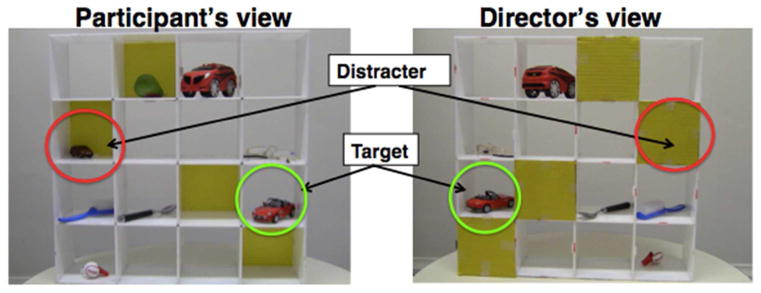

```{r}
#| echo: false
#| warning: false
#| message: false

library(countdown)
library(tidyverse)
library(bayesrules)
library(ggformula)
library(rsample)
library(broom)
library(gganimate)
library(patchwork)
library(fontawesome)
library(here)
library(gt)
library(gtsummary)
library(carData)
library(ggResidpanel)
library(ggthemes)

notes_theme = theme_minimal(base_size = 14, base_family = "Source Sans 3")
theme_set(notes_theme)

regression_panel <- function(formula, scat.formula = NULL, data, xlab, ylab) {
  mod <- lm(formula, data = data)
  
  aug <- augment(mod)
  
  plot_fit <- makeFun(mod)
  
  if(is.null(scat.formula)) {
    orig_data <- gf_point(formula, data = data, xlab = xlab, ylab = ylab, color = "#003300")
  } else {
    orig_data <- gf_point(scat.formula, data = data, xlab = xlab, ylab = ylab, color = "#003300") 
  }
  
  orig_data <- orig_data %>% gf_fun(plot_fit(x) ~ x, color = "#f15a31")
  
  resid_plot <- gf_point(.std.resid ~ .fitted, data = aug, xlab = "Fitted values", ylab = "Standardized residuals") %>%
    gf_hline(yintercept = 0, linetype = 2, color = "#f15a31")
  
  qq_plot <- gf_qq(~.std.resid, data = aug, xlab = "N(0,1) quantiles", ylab = "Standardized residuals", color = "#003300") %>%
    gf_qqline(color = "#f15a31")
  
  (orig_data | resid_plot | qq_plot)
}


bikes_mlr <- lm(rides ~ temp_actual*weekend, data = bikes)

news <- bayesrules::fake_news |>
  mutate(has_excl = ifelse(title_has_excl | text_excl > 0, TRUE, FALSE)) |>
  select(title, url, type, title_words, has_excl, title_caps_percent, negative, positive) |>
  mutate(type_num = as.numeric(type == "fake"))

news_mod <- glm(type_num ~ title_words + has_excl + title_caps_percent, 
                data = news, family = "binomial")

```

## `moths` from last homework

::: medium

```{r}
moths <- read.csv("https://aluby.github.io/stat230/data/moths.csv") |>
  mutate(notremoved = Placed - Removed, 
               log_odds_removed = log(Removed / notremoved),
               prop_removed = Removed / Placed, 
               dark = ifelse(Morph=="dark",1,0), 
               distance = Distance, 
               morph = Morph) 

moths |>
  select(Morph, Distance, Placed, Removed)
```

:::

## Binomial logistic regression model

```{r}
#| echo: true
#| eval: false


binomial_glm <- glm(Y/n ~ predictors, weights = n,
                data = dataset, 
                family = "binomial")
```

```{r}
#| echo: true


moth_glm <- glm(Removed/Placed ~ morph*distance, weights = Placed,
                data = moths, 
                family = "binomial")
```

```{r}
tidy(moth_glm)
```

## Model assumptions

- **Binomial counts**: $Y_i \sim \text{Binom}(m_i, \pi_i)$

- **Independence**: observations are independent ($Y_i$'s are independent *and* each 1/0 that contributes to $Y_i$ is independent)

- **Linearity**: the log odds is a linear function of the predictors

- **Variance structure**: the variance of a binomial random variable is $n \pi (1 - \pi)$

    $\Longrightarrow$ so the variance of $Y_i$ is $m_i \pi_i (1 - \pi_i)$ (not constant!)


## Goodness-of-fit test

::: medium

Deviance can be used to assess the **overall fit** of a binomial logistic regression model


Observed Count | Predicted P(Success) | True P(Success) | Predicted Count 
:---------:|:---------:|:---------:|:---------:
$Y_i$ | $\widehat{\pi}_i$ | $\pi_i$ | $m_i \widehat\pi_i$


<br>

<br>

**Deviance:** $D = 2 \sum \left[ Y_i \log \left( \dfrac{Y_i}{m_i\widehat{\pi}_i} \right)  + (m_i - Y_i)  \log \left( \dfrac{m_i - Y_i}{m_i - m_i \widehat{\pi}_i} \right) \right]$

:::
<br>


::: small

$D \overset{\cdot}{\sim} \chi^2$ with $\text{d.f.}= n-(p+1)$, **if** the model is correct and all $m_i$ are large enough (>5)


$n =$ \# of binomial observations (\# of proportions, not # of moths)
:::


## Goodness-of-fit test

<div style="float: right; clear: right; margin: 10px;">(the model is adequate)</div>

:::{style="font-size:0.9em"}
H<sub>0</sub>: ${\rm logit}(\pi_i) = \beta_0 + \beta_1 x_{1i} + \cdots + \beta_p x_{pi}$
:::

<div style="float: right; clear: right; margin: 10px;">(the model is inadequate)</div>

:::{style="font-size:0.9em"}
H<sub>a</sub>: ${\rm logit}(\pi_i) = \alpha_i$
:::


<br>

::: medium

```{r eval=FALSE}
summary(moth_glm)
```
```
Call:
glm(formula = Removed/Placed ~ Distance * Morph,
    family = binomial, data = case2102, weights = Placed)

    Null deviance: 35.385  on 13  degrees of freedom
*Residual deviance: 13.230  on 10  degrees of freedom
```

<br>

```{r}
#| echo: true
1- pchisq(13.230, 10)
```

:::

<br>

:::{style="font-size:0.5em"}
Note: This test is *only valid for the binomial logistic regression*, it is not valid for binary logistic regression.
:::

## Communication Development Study

<br>

::: medium

> Our proposal, thus, is about the social consequences of growing up in a multilingual versus monolingual environment, rather than the impact of being bilingual per se. We propose that routine exposure to people who speak different languages provides children with a formative communication environment that is fundamentally different from that experienced by monolingual children. Exposure to diverse socio-linguistic environments could grant children with a profound understanding of differences between people’s perspectives, naturally enhancing their communicative abilities. 

:::

<br> 

<br>

::: xsmall
Fan, S. P., Liberman, Z., Keysar, B., & Kinzler, K. D. (2015). The Exposure Advantage: Early Exposure to a Multilingual Environment Promotes Effective Communication. Psychological science, 26(7), 1090–1097. <https://doi.org/10.1177/0956797615574699>
:::

## 

<br>

> “I see a small car. Can you move the small car under the spoon?”



## Data

::: small

```{r}
Lang <- read.csv(here::here("data/Lang.csv"))

language <- Lang |>
  mutate(
    sex = gender - 1,
    language = case_when(language == 1 ~ "Monolingual", 
                         language == 2 ~ "Exposed",
                         language == 3 ~ "Bilingual"),
    kbit = kbit,
    maternal_ed =  mated,
    ppvt = ppvt, 
    success = grid, 
    trials = 4
  ) |>
  drop_na(success) |>
  select(subject, age, sex, language, kbit, maternal_ed, ppvt, success, trials)

language
```

:::

::: task
What is $Y$? What is $n$? What are the possible predictors? What is the primary predictor we want to make inference about?
:::

## Binomial model

::: medium

```{r}
#| echo: true
lang_glm <- glm(success/trials ~ sex + kbit + ppvt + 
                  maternal_ed + age + language, 
                data = language, 
                family = "binomial",
                weights = trials)
```

```{r}
tidy(lang_glm, conf.int = TRUE) |>
  select(-c("statistic", "p.value"))
```

:::

. . . 

&rarr; Relative to Bilingual children, after accounting for all other variables in the model, monolingual children are worse at the task

## Goodness of fit test

```{r}
#| echo: true
#| eval: false

summary(lang_glm)
```
```
    Null deviance: 197.54  on 68  degrees of freedom
Residual deviance: 167.35  on 61  degrees of freedom
  (3 observations deleted due to missingness)
AIC: 237.72
```

<br>

```{r}
#| echo: true

1 - pchisq(167.35, df = 61)
```

. . . 

Indicates the model is **inadequate**

## 

If model is correct, Pearson residuals should be approximate N(0,1)

```{r}
#| echo: true
lang_aug <- augment(lang_glm, type.residuals = "pearson")

mean(lang_aug$.resid)
sd(lang_aug$.resid)
```

```{r}
#| fig-width: 8
#| fig-height: 3
p1 <- gf_qq(~.resid, data = lang_aug) |>
  gf_qqline()

p2 <- gf_dhistogram(~.resid, data = lang_aug, col = "white", fill = "darkgreen") |>
  gf_dist("norm", linewidth = 1.5)

p1 + p2
```

. . . 

&rarr; These Pearson residuals are too variable

## 

::: medium

In linear regression, the mean model ($\mu_y$) and the variance term ($\epsilon$) are independent. We can have points that are tightly clustered along the line or widely spread and both models are equally "valid"

```{r}
#| fig-width: 8
#| fig-height: 3
#| fig-align: center


set.seed(051926)

sim_data <- tibble(
  x = rnorm(100) + 100,
  y1 = 5+1.25*x + rnorm(100),
  y2 = y1 + rnorm(100, sd = 3)
)

p1 <- sim_data |>
  gf_point(y1 ~ x) |>
  gf_lm() + 
  ylim(c(120, 140))

p2 <- sim_data |>
  gf_point(y2 ~ x) |>
  gf_lm() + 
  ylim(c(120, 140))

p1 + p2
```


In binomial logistic regression, the variance term is related to the mean model through a mathematical relationship: 

$$\mu(Y) = n\pi \quad Var(Y) = n\pi(1-\pi)$$
**Overdispersion** occurs when the actual, observed variance in our data is significantly larger than what we'd expect from these formulas

:::

## Diagnosing overdispersion

```{r}
#| echo: true
#| eval: false
summary(lang_glm)
```

```
(Dispersion parameter for binomial family taken to be 1)

    Null deviance: 197.54  on 68  degrees of freedom
Residual deviance: 167.35  on 61  degrees of freedom
  (3 observations deleted due to missingness)
AIC: 237.72
```

Ad-hoc dispersion test: $\text{disp} \approx \frac{\text{Residual Deviance}}{\text{degrees of freedom}} = \frac{167.35}{61} \approx 2.7$

- $\text{disp}  \approx 1$: not overdispersed
- $\text{disp}  >> 1$ overdispersed

## Fixing overdispersion: the `quasibinomial` family

```{r}
#| echo: true
lang_qglm <- glm(success/trials ~ sex + kbit + ppvt + 
                  maternal_ed + age + language, 
                data = language, 
                family = "quasibinomial", 
                weights = trials)

```

```
(Dispersion parameter for quasibinomial family taken to be 2.351658)

    Null deviance: 197.54  on 68  degrees of freedom
Residual deviance: 167.35  on 61  degrees of freedom
  (3 observations deleted due to missingness)
AIC: NA
```

::: small
R uses a slightly different formula to calculate dispersion parameter; should not make a meaningful difference
:::

## What changed?

:::: {.columns}

::: {.column width="45%"}
**Binomial:**

::: small
```{r}
tidy(lang_glm)[,1:3]
```
:::

:::

::: {.column width="45%"}
**Quasibinomial:**

::: small

```{r}
tidy(lang_qglm)[,1:3]
```
:::

:::

::::

## Back to t-distributions 

$\widehat \psi$ is dispersion parameter from R

$$SE_{\text{quasi}}(\widehat\beta) = \sqrt{\hat \psi} SE_{\text{binom}}(\widehat\beta)$$

:::: {.columns}
::: {.column width="25%"}
**Test statistic:**
:::

::: {.column width="75%"}

$$t = \frac{\widehat \beta - 0}{SE(\widehat \beta)} =\frac{\widehat \beta - 0}{\sqrt{\hat \psi} SE_{\text{binom}}(\widehat\beta)} $$
:::

::::

<br>

:::: {.columns}
::: {.column width="25%"}
**Reference distribution**
:::

::: {.column width="75%"}

$t_{n-(p+1)}$ when $H_0$ is true (p = number of predictors)

:::

::::

## Back to F tests

:::: {.columns}
::: {.column width="25%"}
**Hypotheses:**
:::

::: {.column width="75%"}
::: {.fragment fragment-index=1}
$H_0: \beta_i = \beta_j = ... = 0 \quad$ vs. $\quad H_a: \text{at least 1 } \beta \ne 0$
:::
:::

::::

:::: {.columns}
::: {.column width="25%"}
**Test statistic:**
:::

::: {.column width="75%"}
::: {.fragment fragment-index=2}

$$F = \frac{\text{LRT Test Statistic}}{\text{Dispersion Parameter}} = \frac{\Delta}{\widehat\psi}$$
:::
:::

::::

<br>


:::: {.columns}
::: {.column width="25%"}
**Reference distribution:**
:::

::: {.column width="75%"}
::: {.fragment fragment-index=3}
$F_{df_1, df_2}$, where $df_1=$ the number of extra coefficients and $df_2$ = n - number of coefficients in full model
:::
:::

::::

## Example: is language necessary in the model? 

$H_0: \beta_6 = \beta_7 = 0 \quad H_A:$ at least one $\ne 0$

::: small

```{r}
#| echo: true 


reduced_qglm <- glm(success/trials ~ sex + kbit + ppvt + 
                  maternal_ed + age, 
                data = language, 
                family = "quasibinomial", 
                weights = trials)

anova(reduced_qglm, lang_qglm, test = "F")
```


<br>

. . . 

&rarr; only significant at $\alpha = .1$ level; weaker evidence that language background explains P(Success)

:::

## What about effect of *monolinguism*?

```{r}
#| echo: true

exp(confint(lang_qglm))
```

<br> 

&rarr; We are 95% confident that the odds of success for monolingual children is somewhere between 2.5% to 89% smaller than for bilingual children, holding the other variables constant.

## Strategy for binomial logistic regression: 

1. First, make sure data is grouped appropriately (each row is independent)
2. Start by fitting `family = "quasibinomial"`
    - If $\psi > 1$, stick with it
    - If $\psi \approx 1$, doesn't matter which one you choose
    - If $\psi \le 1$, switch to the binomial model 
  
