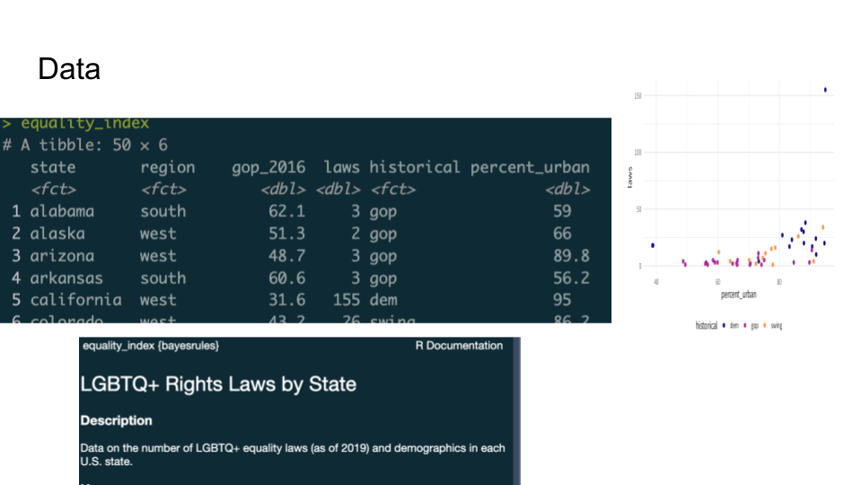
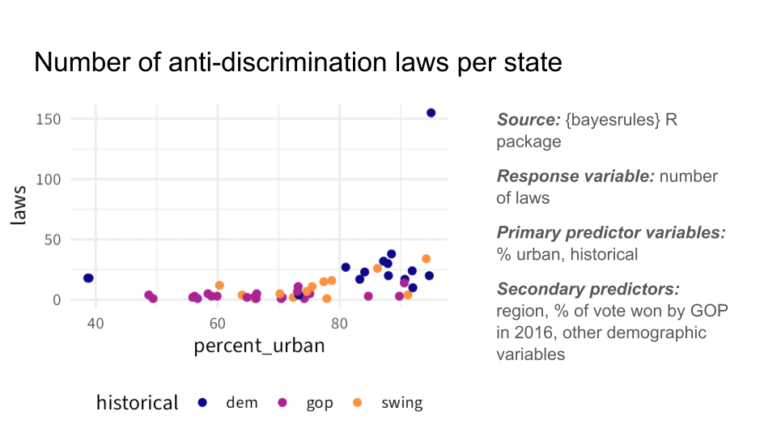
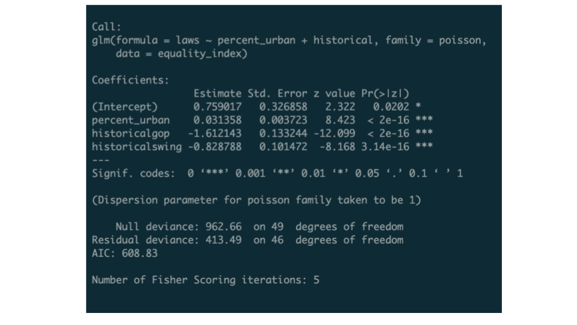
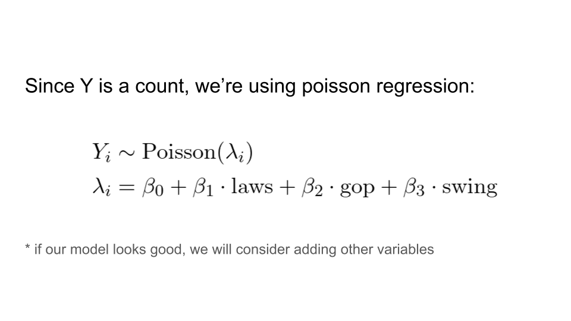
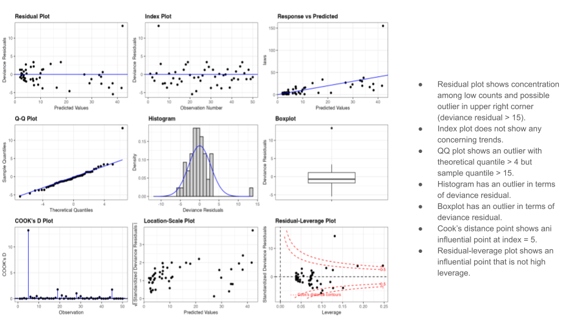
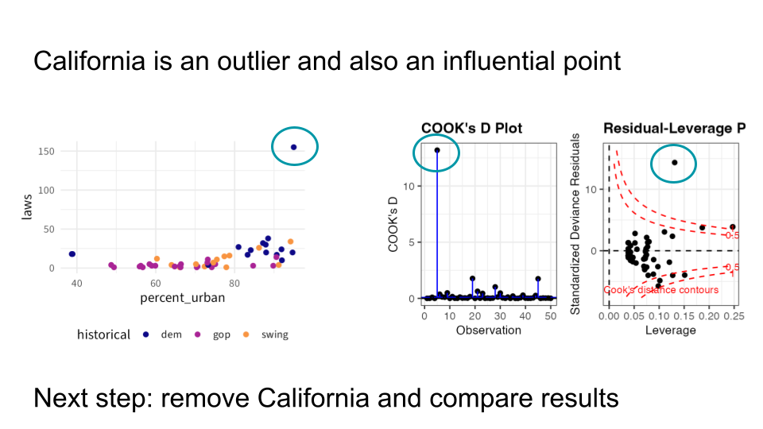

```{r}
#| echo: false
#| warning: false
#| message: false

library(countdown)
library(tidyverse)
library(bayesrules)
library(ggformula)
library(rsample)
library(broom)
library(gganimate)
library(patchwork)
library(fontawesome)
library(here)
library(gt)
library(gtsummary)
library(carData)
library(ggResidpanel)
library(ggthemes)

notes_theme = theme_minimal(base_size = 14, base_family = "Source Sans 3")
theme_set(notes_theme)

regression_panel <- function(formula, scat.formula = NULL, data, xlab, ylab) {
  mod <- lm(formula, data = data)
  
  aug <- augment(mod)
  
  plot_fit <- makeFun(mod)
  
  if(is.null(scat.formula)) {
    orig_data <- gf_point(formula, data = data, xlab = xlab, ylab = ylab, color = "#003300")
  } else {
    orig_data <- gf_point(scat.formula, data = data, xlab = xlab, ylab = ylab, color = "#003300") 
  }
  
  orig_data <- orig_data %>% gf_fun(plot_fit(x) ~ x, color = "#f15a31")
  
  resid_plot <- gf_point(.std.resid ~ .fitted, data = aug, xlab = "Fitted values", ylab = "Standardized residuals") %>%
    gf_hline(yintercept = 0, linetype = 2, color = "#f15a31")
  
  qq_plot <- gf_qq(~.std.resid, data = aug, xlab = "N(0,1) quantiles", ylab = "Standardized residuals", color = "#003300") %>%
    gf_qqline(color = "#f15a31")
  
  (orig_data | resid_plot | qq_plot)
}


bikes_mlr <- lm(rides ~ temp_actual*weekend, data = bikes)

news <- bayesrules::fake_news |>
  mutate(has_excl = ifelse(title_has_excl | text_excl > 0, TRUE, FALSE)) |>
  select(title, url, type, title_words, has_excl, title_caps_percent, negative, positive) |>
  mutate(type_num = as.numeric(type == "fake"))

news_mod <- glm(type_num ~ title_words + has_excl + title_caps_percent, 
                data = news, family = "binomial")

```


## What is a lightning talk? 

## Data Overview

::: {.panel-tabset}

## Example 1



## Example 2



:::

## Model

::: {.panel-tabset}

## Example 1



## Example 2



:::

## One cool thing

::: {.panel-tabset}

## Example 1



## Example 2



:::


## Data

:::: {.columns}

::: {.column width="60%"}
**Do:** 

- Show a plot
- Tell us where you found it
- "Hook" us with your research question right away: why should we care about your project?

:::

::: {.column width="40%"}

**Don't**:

- List 15 variables in a list or a screenshot of R 
- Read variables like a grocery list

:::

::::

## Modeling approach

:::: {.columns}

::: {.column width="60%"}
**Do:** 

- Use context (eg `laws`) instead of variable names (`y`)
- Format your math! 
- Justify why this model is appropriate

:::

::: {.column width="40%"}

**Don't**:

- Copy-paste a massive `summary` output

:::

::::

## The "one thing"

:::: {.columns}

::: {.column width="60%"}
**Do:** 

- Think about the "10 second rule": can someone in this class figure out what the main point of the slide is in 10 seconds without you speaking? 
- Use a large font
- Show us a picture! 
- Tell us what your "next steps" are

:::

::: {.column width="40%"}

**Don't**:

- Include too much text
- Include too many pictures 
- Think of this as an afterthought
:::

::::

## Other tips

- You cannot successfully "wing" a 3 minute talk, especially as a group. 
- Practice together at least twice
- This is a work in progress! Your graphs do not need to be perfect (but they do need to be readable) 
- *no code* unless there is a specific question/thing you want to mention

## Your role as an audience member
